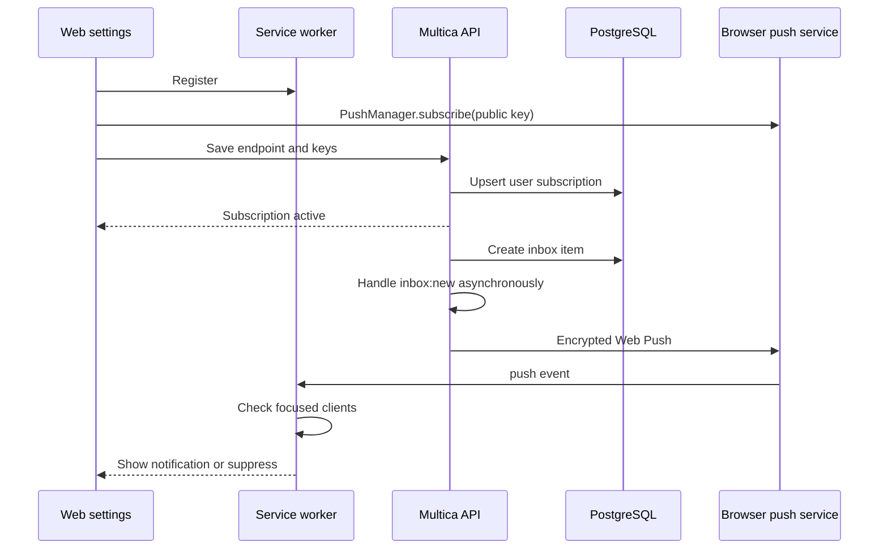

# Durable Web Push Notifications - Plan

## Goal Capsule

- Deliver native browser notifications for new inbox items after the Multica web tab is closed.
- Preserve existing inbox creation, realtime updates, per-workspace preferences, and desktop behavior.
- Use standards-based Web Push with encrypted payloads and server-held VAPID private material.
- Keep delivery best effort so push-provider failures never block issue comments or inbox persistence.
- Publish the result as an immutable fork release based on `v0.3.43`.

---

## Product Contract

### Summary

The web client currently calls `new Notification()` only after a live `inbox:new` WebSocket event.
This supports an open background tab but cannot deliver after the tab closes or a connection is missed.
The new path registers a service worker and Push subscription, persists it for the authenticated user, and sends encrypted Web Push for eligible inbox events.

### Requirements

- R1. An eligible inbox item must reach an active browser Push subscription without requiring an open Multica page.
- R2. The sender must skip workspaces where `system_notifications` is muted and must never change inbox persistence.
- R3. The service worker must suppress a banner when any same-origin Multica window is focused.
- R4. Notification clicks must open the source workspace inbox and select the source issue or inbox item.
- R5. Subscription endpoints must be authenticated, user-scoped, validated, idempotent, and isolated across accounts.
- R6. Push endpoints returning HTTP 404 or 410 must be removed; transient failures must retain the subscription for later delivery.
- R7. VAPID private material must be read only from server environment and never exposed through logs, responses, or frontend assets.
- R8. Browsers without Push support must retain the existing open-page Notification API fallback.
- R9. Settings must display permission/subscription state and allow a user-initiated test notification.
- R10. Deployment configuration and operator documentation must describe VAPID keys, image pinning, and verification.

### Acceptance Examples

- AE1. Given permission and a valid subscription, when the tab is closed and a new comment creates an inbox row, then one system banner appears and its click opens the issue.
- AE2. Given a focused Multica tab, when the same push arrives, then no system banner appears and realtime UI state still updates.
- AE3. Given `system_notifications=muted` in workspace A and default preferences in workspace B, when both create inbox rows, then only workspace B sends Push.
- AE4. Given a stale endpoint returns 410, when delivery runs, then the endpoint is deleted and the inbox request remains successful.
- AE5. Given permission is granted but the backend subscription was lost, when the dashboard mounts, then the client recreates the subscription idempotently.

### Scope Boundaries

- Native APNs mobile support is excluded.
- Delivery while the entire Mac is asleep depends on the browser push service and may occur after wake.
- Browser permission still requires a user gesture and cannot be granted by the server.
- The existing Electron notification bridge is unchanged.

---

## Planning Contract

### Key Technical Decisions

- KTD1. Use `github.com/SherClockHolmes/webpush-go` for RFC-compliant encryption and VAPID signing.
- KTD2. Store subscriptions by authenticated user and endpoint rather than workspace so one browser registration covers every authorized workspace.
- KTD3. Subscribe a best-effort dispatcher to the existing `inbox:new` event after notification listeners are registered.
- KTD4. Load the source workspace preference and slug at delivery time; never trust client-supplied routing data for server events.
- KTD5. Register a same-origin service worker from the web shell and reconcile the subscription on dashboard mount.
- KTD6. Use the existing Notification API only when Push or service workers are unsupported; supported subscribed clients rely on the service worker to avoid duplicate banners.
- KTD7. Expose only VAPID availability and public key through the API; use environment variables for private key and subject.

### High-Level Technical Design

### Risks and Dependencies

- Push-service endpoints are untrusted input and require strict size, scheme, and key validation.
- Async delivery must use bounded timeouts and recover panics so it cannot leak goroutines or block event processing.
- Service-worker cache behavior must not cache authenticated API responses or alter existing Next.js navigation.
- Upgrading from `v0.3.31` to the fork base adds migrations; database backup and rollback image pins are required.

---

## Implementation Units

### U1. Persist user Push subscriptions

- **Requirements:** R5, R6, R7.
- **Files:** `server/migrations/`, `server/pkg/db/queries/web_push_subscription.sql`, `server/pkg/db/generated/`.
- **Approach:** Add a user-scoped subscription table with unique endpoint, encrypted-key fields, timestamps, and cascade deletion; add list, upsert, delete-by-endpoint, and delete-by-id queries.
- **Test scenarios:** New insert, idempotent endpoint update, endpoint reassignment to the current authenticated user, user-scoped list, cascade delete, terminal cleanup.
- **Verification:** Run migrations on a clean test database, regenerate sqlc, and run focused query-backed tests.

### U2. Add authenticated subscription API and dispatcher

- **Requirements:** R1, R2, R4-R7.
- **Files:** `server/internal/handler/web_push.go`, `server/internal/webpush/`, `server/cmd/server/router.go`, `server/cmd/server/main.go`, `server/go.mod`, `server/go.sum`.
- **Approach:** Add config, subscribe/unsubscribe/test endpoints, strict request validation, an `inbox:new` listener, preference gating, payload construction, bounded asynchronous sending, and 404/410 cleanup.
- **Execution note:** Write handler and dispatcher regression tests before production implementation.
- **Test scenarios:** Disabled config, config response, auth failure, invalid endpoint/key, idempotent subscribe, cross-user isolation, muted preference, successful send, transient send error, terminal cleanup, test endpoint.
- **Verification:** Run focused package tests and `cd server && go test ./...`.

### U3. Add typed frontend Push client

- **Requirements:** R5, R7-R9.
- **Files:** `packages/core/api/client.ts`, `packages/core/api/schemas.ts`, `packages/core/types/`, `packages/core/platform/web-push.ts`, corresponding tests.
- **Approach:** Add parsed API responses, base64url conversion, service-worker registration, subscription reconciliation, logout-safe unsubscribe, and explicit effective-state reporting.
- **Execution note:** Add failing pure-function and API parsing tests before implementation.
- **Test scenarios:** Malformed config response, unsupported platform, missing key, existing subscription, renewed subscription, backend resync, permission denied, logout cleanup.
- **Verification:** Run focused core tests and typecheck.

### U4. Add service worker delivery and settings UX

- **Requirements:** R1, R3, R4, R8, R9.
- **Files:** `apps/web/public/multica-push-sw.js`, `apps/web/components/web-notification-bridge.tsx`, `packages/core/realtime/use-realtime-sync.ts`, `packages/views/settings/components/browser-notification-setting.tsx`, locale files, corresponding tests.
- **Approach:** Handle push and click events, suppress when a focused client exists, open or focus the correct deep link, reconcile registration from the web bridge, avoid duplicate live notifications, show effective state, and provide a test action.
- **Execution note:** Preserve the current fallback tests and add worker behavior coverage before switching the delivery path.
- **Test scenarios:** Focused suppression, no-client display, malformed payload ignore, click existing client, click new window, fallback browser, active subscription, stale subscription repair, test notification success/failure.
- **Verification:** Run focused core/views/web tests, full `pnpm test`, `pnpm typecheck`, and `pnpm build`.

### U5. Document and package the deployment contract

- **Requirements:** R7, R10.
- **Files:** `.env.example`, `docker-compose.selfhost.yml`, `apps/docs/content/docs/environment-variables.mdx`, `apps/docs/content/docs/self-host-quickstart.mdx` and translated equivalents required by repository policy.
- **Approach:** Add VAPID variables, secure generation guidance, immutable image examples, and closed-tab verification steps without logging private values.
- **Test scenarios:** Compose config with variables unset and set, documentation parity, frontend image contains the service worker.
- **Verification:** Run self-host config tests, docs checks, and inspect built container contents.

---

## Verification Contract

| Scope | Command | Done signal |
|---|---|---|
| Generated DB code | `make sqlc` | Generated files match queries and schema |
| Backend focused | `cd server && go test ./internal/webpush ./internal/handler ./cmd/server` | API, preference, delivery, and cleanup tests pass |
| Backend full | `cd server && go test ./...` | No server regression |
| Frontend tests | `pnpm test` | Push client, service worker helpers, fallback, and settings tests pass |
| Type safety | `pnpm typecheck` | All workspaces compile |
| Production build | `pnpm build` | Next.js standalone output includes the worker and compiles |
| Container build | Build `Dockerfile` and `Dockerfile.web` | Linux AMD64 images build from the release commit |
| Browser smoke | Chrome on `https://multica.aiparis.org` | Background and closed-tab banners work; focused tab suppresses; click routes correctly |

---

## Definition of Done

- A closed production tab receives one banner for a newly created eligible inbox item.
- Preference mute, focused suppression, click routing, stale cleanup, and account isolation have automated coverage.
- VAPID private material exists only in the protected VPS environment and is absent from repository history, command output, and logs.
- The existing desktop bridge and unsupported-browser fallback continue to work.
- Full backend tests, frontend tests, typecheck, and production build pass.
- The release is committed, tagged, published under immutable image tags, deployed with a database backup, and read back by image digest.
- Temporary test subscriptions, debug hooks, and abandoned approaches are removed.
