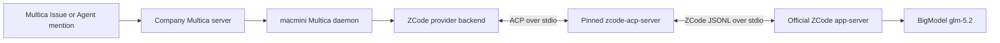

# Add ZCode as a Production Multica Runtime

## Goal Capsule

Make Zhipu's official ZCode coding agent selectable and callable as a first-class Multica runtime in the company workspace. The shipped path must run the official ZCode headless app-server, use the supplied BigModel API credential without exposing it, preserve Multica issue/session semantics, and be available to Potter from the existing self-hosted Multica instance after this plan is executed.

---

## Problem Frame

ZCode 3.7.7 is Zhipu's official agent harness and includes both single-prompt and stdio app-server modes. Its app-server uses a private newline-delimited JSON protocol rather than ACP, so Multica cannot register the `zcode` executable through an existing ACP custom runtime profile without a translation boundary.

Multica upstream PR [#6987](https://github.com/multica-ai/multica/pull/6987) already implements a ZCode runtime family and verifies it against ZCode 3.7.7 / CLI 0.16.3. It drives the official runtime through the Apache-2.0 `zcode-acp-server` bridge. The published npm 0.1.0 package predates the ZCode 0.16 runtime-preferences handshake fix, so production must use an audited, immutable bridge revision containing [zcode-acp #38](https://github.com/william0wang/zcode-acp/pull/38), not the broken npm tarball.

The company production fork has diverged from current Multica upstream. The ZCode work must therefore be selectively ported onto `MgPotter2024/multica` rather than merging upstream `main` wholesale.

---

## Requirements

- **R1:** `zcode` is a recognized Multica provider across daemon discovery, execution, model discovery, runtime profiles, metrics, shared types, UI display, and documentation.
- **R2:** Tasks run through the official ZCode 3.7.7 headless runtime; the bridge is only a protocol translator and must be pinned to an audited immutable source revision.
- **R3:** The supplied BigModel Open Platform key is stored only in ZCode's local credential configuration with restrictive permissions, never in Git, comments, agent metadata, or command arguments.
- **R4:** The runtime supports fresh sessions, continued sessions, streamed text and tools, model selection, graceful cancellation, and a fresh-session retry only after a confirmed rejected resume. The first company-fork release uses ZCode's configured reasoning default.
- **R5:** Missing or incompatible ZCode/bridge installations fail visibly and keep the runtime unavailable rather than accepting tasks that cannot execute.
- **R6:** The company production backend/frontend and macmini daemon run the same approved company-fork commit, and the ZCode runtime registers online after deployment.
- **R7:** Potter can invoke a dedicated ZCode-backed Agent from an Issue using a real Agent mention, and a customer-path task completes with observable tool use and a useful final response.

---

## Scope Boundaries

### In Scope

- Selective adoption and adaptation of upstream PR #6987 on the company fork.
- Official ZCode installation on the macmini runtime host.
- Audited bridge build/install pinned to a fixed commit that includes the ZCode 0.16 handshake repair.
- Local ZCode BigModel provider configuration for the already-verified `glm-5.2` route.
- Company-fork PR, production release, exact-commit deployment, dedicated Multica Agent creation, and real invocation.

### Out of Scope

- Advertising GLM capabilities that the current credential previously failed to access, including `glm-5.3` until its entitlement is verified.
- Replacing ZCode's private protocol with a new public protocol or maintaining a fork of ZCode itself.
- Expanding the supplied API credential to other runtimes, workspaces, or unrelated agents.
- Refactoring unrelated Multica provider code while resolving company-fork drift.

### Deferred to Follow-Up Work

- Removing the bridge if ZCode publishes a stable ACP mode or public protocol SDK.
- Usage/billing counters beyond what ZCode currently emits through the bridge.
- Wider workspace access or higher concurrency after the dedicated Agent's live behavior is accepted.

---

## Key Technical Decisions

### KTD1. Drive the official runtime through an ACP translation boundary

ZCode's own `app-server --stdio` remains the execution engine. The bridge converts its private JSONL messages to the ACP transport Multica already understands; it does not substitute a different agent harness or model client. This preserves ZCode's native tools, prompts, session storage, and provider behavior while avoiding a second large protocol implementation in the company fork.

### KTD2. Pin source, not npm 0.1.0

The npm 0.1.0 release is known to hang during session creation with ZCode 0.16+. Build and install from audited commit `a5cb8a1ae8201fd2c9fcc51ebffebf4e343e8391`, which contains the runtime-preferences handshake repair and was the revision used by upstream PR #6987's real-stack validation. Installation provenance and the resolved executable path must be recorded during deployment.

### KTD3. Selectively port upstream PR #6987

Reuse the upstream provider implementation and tests where they fit, but transplant only ZCode-related changes onto company `main`. Resolve migration numbering and API drift against the company tree, preserve company delivery gates, and do not merge the unrelated upstream history.

### KTD4. Treat the BigModel key as runtime-local ZCode configuration

Configure a single enabled BigModel custom provider in ZCode's versioned config with the general OpenAI-compatible endpoint and `glm-5.2`, matching the credential's verified entitlement. Restrictive filesystem permissions are the secret boundary. The Multica Agent does not duplicate the key in `custom_env`.

### KTD5. Release before live configuration

Merge the validated feature to company `main`, release backend/frontend and the macmini CLI/daemon from that exact commit, then install/configure the ZCode runtime and create the Agent. This preserves the company invariant that production branch HEAD equals live code.

---

## High-Level Technical Design



```mermaid
sequenceDiagram
    participant U as Potter
    participant M as Multica
    participant Z as ZCode runtime
    U->>M: Assign or mention ZCode Agent
    M->>Z: Create or resume session with issue context
    Z-->>M: Stream thoughts, tool events, and text
    M-->>U: Render live execution timeline
    Z-->>M: Complete with persisted session id
    U->>M: Follow-up comment
    M->>Z: Resume; retry fresh only when resume is rejected
```

---

## Implementation Units

### U1. Port the ZCode provider contract

**Goal:** Add the ZCode provider to the company fork using the proven upstream implementation while preserving company-specific behavior.

**Requirements:** R1, R4, R5

**Dependencies:** None

**Files:**

- `server/pkg/agent/zcode.go`
- `server/pkg/agent/zcode_test.go`
- `server/pkg/agent/agent.go`
- `server/pkg/agent/agent_supported_types_test.go`
- `server/pkg/agent/models.go`
- `server/pkg/agent/models_test.go`
- `server/internal/daemon/config.go`
- `server/internal/daemon/daemon.go`
- `server/internal/daemon/local_skills.go`
- `server/internal/daemon/execenv/context.go`
- `server/internal/daemon/execenv/runtime_config.go`
- `server/internal/daemon/execenv/runtime_config_sections.go`
- `server/internal/metrics/labels.go`

**Approach:** Transplant the upstream ZCode ACP backend, discovery hooks, model catalog mapping, cancellation, and resume-rejection handling. Adapt only where the company tree's shared ACP or daemon APIs differ. Require `zcode-acp-server` as the process Multica launches and also resolve the official `zcode` command or standard macOS app-bundle entry point before advertising the runtime. Use ZCode's configured thought level in this first release; the company fork does not yet have upstream's per-model ACP effort catalog plumbing.

**Patterns to follow:** Existing `qoder`, `kimi`, and `grok` ACP backends; upstream PR #6987.

**Test scenarios:**

1. A fresh session streams a named tool event plus final text and returns a reusable session id.
2. A requested model that ZCode rejects fails the task instead of silently using another model.
3. A dead resumed session clears its id and signals a fresh-session retry.
4. Resume-time history replay is excluded from the new turn's output.
5. Cancellation sends the graceful stop notification before process reaping and returns an aborted result.
6. A missing bridge executable leaves discovery unavailable and returns a precise launch error.
7. Bound Multica skills land in `.agents/skills/`, the native project-level path scanned by ZCode and the pinned bridge.
8. A non-empty Agent `mcp_config` fails visibly until an audited bridge revision includes the still-unmerged MCP forwarding change.
9. AskUserQuestion-style ACP permission requests are cancelled rather than auto-answered, while recognized tool permission options remain auto-approved for unattended work.
10. Runtime-local skill list/import exposes ZCode's native universal `~/.agents/skills` root.

**Verification:** Focused backend and daemon tests pass without resolving or running ambient user-installed CLIs.

### U2. Add persistence, shared product surfaces, and documentation

**Goal:** Make ZCode a complete first-class provider across storage constraints and customer-visible runtime selection.

**Requirements:** R1, R5

**Dependencies:** U1

**Files:**

- `server/migrations/*_runtime_profile_add_zcode.up.sql`
- `server/migrations/*_runtime_profile_add_zcode.down.sql`
- `packages/core/types/agent.ts`
- `packages/core/runtimes/display.ts`
- `packages/views/runtimes/components/provider-logo.tsx`
- `packages/views/runtimes/components/zcode-logo.png`
- `apps/docs/content/docs/providers.mdx`
- `apps/docs/content/docs/providers.zh.mdx`
- `apps/docs/content/docs/install-agent-runtime.mdx`
- `apps/docs/content/docs/install-agent-runtime.zh.mdx`
- `apps/docs/content/docs/environment-variables.mdx`
- `apps/docs/content/docs/environment-variables.zh.mdx`
- `apps/web/features/landing/i18n/en.ts`
- `apps/web/features/landing/i18n/zh.ts`

**Approach:** Add the provider to the runtime-profile whitelist, shared provider type, runtime naming, logo mapping, install/environment documentation, and supported-runtime copy. Include other maintained locales only where the company branch still carries the corresponding surfaces. Choose the next migration number from the company tree.

**Patterns to follow:** The most recently added first-class ACP provider in the company branch and the repo's locale conventions.

**Test scenarios:**

1. The backend accepts `zcode` as a runtime-profile protocol family and the down migration restores the previous whitelist.
2. Shared runtime display resolves `zcode` to the expected name and logo without breaking unknown-provider fallback.
3. Provider type checks and frontend compilation include `zcode` without widening types to arbitrary strings.

**Verification:** Migration tests, shared type checks, frontend tests, and production builds succeed on the company tree.

### U3. Install and validate the official local runtime stack

**Goal:** Put a reproducible, secure ZCode execution stack on the macmini daemon host.

**Requirements:** R2, R3, R4, R5

**Dependencies:** U1

**Files:**

- Runtime-local ZCode application installation outside the repository
- Runtime-local bridge installation outside the repository
- Runtime-local `~/.zcode/v2/config.json` outside the repository

**Approach:** Install official ZCode 3.7.7 from Zhipu's distribution, build the bridge from the pinned audited commit, configure the supplied BigModel key as a restrictive local custom-provider secret, and validate both the native app-server handshake and the ACP translation path. Do not add runtime secrets or generated credentials to Git.

**Test scenarios:**

1. The installed app reports the expected ZCode/CLI version and starts its stdio app-server.
2. The bridge initializes and creates a session against ZCode 0.16 without the npm 0.1.0 timeout.
3. `glm-5.2` completes a semantic prompt through the real stack and performs a bounded filesystem/tool action in a disposable directory.
4. An invalid model produces a visible model-selection failure.
5. Credential and config files are not group/world-readable, and diagnostic output contains no API key.

**Verification:** A real-stack smoke produces streamed ACP events and a successful final result while process inspection confirms no orphaned ZCode child remains.

### U4. Ship the company release and register the runtime

**Goal:** Put the approved ZCode integration into the self-hosted Multica server and macmini daemon from one exact company-main commit.

**Requirements:** R6

**Dependencies:** U1, U2, U3

**Files:**

- Company fork Git history, pull request, and release tag
- Self-hosted Multica deployment configuration outside the repository
- macmini daemon installation outside the repository

**Approach:** Run the relevant local verification profile, review the final diff, merge the company PR under the issue's standing deployment authorization, tag the exact company-main merge on the existing `runmux` release line, publish/deploy backend and frontend images, upgrade the macmini CLI/daemon to the same revision, and allow runtime discovery to register ZCode. Avoid any changes to unrelated services on the shared Hermes host.

**Test scenarios:**

1. Backend and frontend image revision labels equal company `main` after deployment.
2. The macmini daemon reports the same commit and ZCode as online with the expected CLI version.
3. A missing or broken bridge probe takes only ZCode offline and does not disturb Claude, Codex, or OpenClaw runtimes.

**Verification:** Production health is green, exact-commit equality is proven across branch, images, and daemon, and existing runtimes remain online.

### U5. Create and exercise the dedicated ZCode Agent

**Goal:** Make the integration immediately usable from Multica and prove the end-user workflow.

**Requirements:** R3, R7

**Dependencies:** U4

**Files:**

- Live Multica Agent configuration outside the repository

**Approach:** Create a dedicated ZCode-backed engineering Agent on the new macmini runtime, pin the bridge-advertised custom-provider id `multica-bigmodel\glm-5.2`, keep concurrency at one for the initial rollout, grant Potter access, and give it execution instructions aligned with the company issue workflow. Invoke it on the existing issue through a real Agent mention so the proof follows the same customer path Potter will use.

**Test scenarios:**

1. The Agent appears in Multica with provider ZCode and model label `GLM-5.2` (id `multica-bigmodel\glm-5.2`).
2. A mention creates one task, streams at least one ZCode-native tool event, and posts a semantically correct final comment.
3. A follow-up turn on the same issue resumes the session without replaying old output.
4. The Agent cannot expose its provider credential through Multica configuration reads or normal task output.

**Verification:** Potter can invoke the Agent by its real mention link, observe progress in the issue timeline, and receive a successful result without administrator-only steps.

---

## Verification Contract

- **V1 Local provider checks:** All focused ZCode backend, model discovery, daemon probe, metrics, and migration tests pass on the prospective merge tree.
- **V2 Broader regression checks:** The repository's relevant Go and TypeScript verification profiles pass with no ambient installed-agent execution.
- **V3 Dependency checks:** The bridge's own test, typecheck, and build pass at the pinned commit; installed executable provenance resolves to that commit rather than npm 0.1.0.
- **V4 Real-stack checks:** Official ZCode performs a fresh task, streamed tool operation, cancellation, and resumed turn through the Multica provider path.
- **V5 Release checks:** Company `main`, deployed backend/frontend image revisions, and macmini daemon build revision are identical.
- **V6 Customer-path check:** A real Multica Agent mention on this issue completes through ZCode and produces a visible, useful response.
- **V7 Secret check:** Git diff, PR content, issue comments, logs sampled for handoff, and Agent metadata contain no API credential.

---

## Risks and Mitigations

- **Private protocol drift:** ZCode can change its internal app-server protocol. Pin both ZCode and bridge revisions initially; take only one layer forward at a time and keep a real-stack smoke as the admission gate.
- **Unpublished bridge fix:** The required handshake repair is not in npm 0.1.0. Build from an immutable audited Git commit and record provenance; do not install mutable `main`.
- **Company-fork drift:** Upstream PR #6987 targets a much newer upstream tree. Selectively port its ZCode-specific commits, retain company workflow patches, and let compile/test failures expose incompatible assumptions.
- **Credential entitlement:** The supplied key works for `glm-5.2` but not `glm-5.3`. Configure and advertise only `glm-5.2`; fail model switches rather than falling back silently.
- **Shared host blast radius:** The macmini and Hermes host run other services. Restrict changes to the ZCode app, user-local bridge/config, Multica daemon, and Multica compose project; verify other runtimes and health after restart.

---

## Sources and Research

- [Official ZCode product and downloads](https://zcode.z.ai/en)
- [Official ZCode installation guide](https://zcode.z.ai/en/docs/install)
- [Official ZCode model/API-key configuration](https://zcode.z.ai/en/docs/configuration)
- [Official ZCode release notes](https://zcode.z.ai/en/changelog)
- [Multica issue #5361: ZCode protocol findings](https://github.com/multica-ai/multica/issues/5361)
- [Multica PR #6987: tested ZCode runtime implementation](https://github.com/multica-ai/multica/pull/6987)
- [zcode-acp source](https://github.com/william0wang/zcode-acp)
- [zcode-acp #38: ZCode 0.16 session handshake repair](https://github.com/william0wang/zcode-acp/pull/38)

---

## Definition of Done

1. ZCode is a first-class provider in the company Multica fork with focused and broader checks passing.
2. The official ZCode runtime and pinned bridge are installed on the macmini with secure BigModel configuration for `glm-5.2`.
3. The validated commit is merged, released, and deployed; company `main`, production images, and daemon revision match.
4. ZCode registers online and existing runtimes remain healthy.
5. A dedicated Potter-accessible ZCode Agent exists and completes a real issue mention plus a follow-up turn.
6. The final ARG-489 comment gives the Agent mention link, PR/release/deploy evidence, verification results, and rollback path without exposing the API key.
